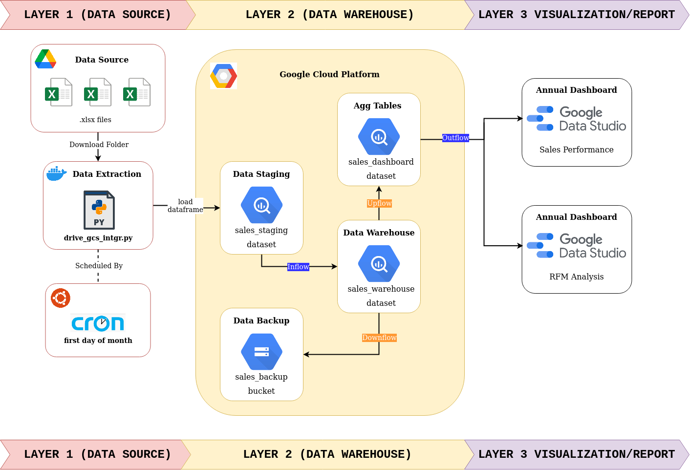

Superstore Sales Data Pipeline (On Progress)
==============================

## Disclaimer
Superstore Dataset in this project is the sample data that used in platinum challenge during participated Business Intelligence Engineer Program at [Binar Academy](https://www.binaracademy.com/). The original work of this project was developed by the Wizard Team (Wildan Wahyudin, Izzatusy Shaidah & Andriani Shelvia Purba), but I have modified several processes: 
1. Using Python, Docker and CronTab to schedule data extraction process instead of manual download and upload to Google BigQuery. 
2. Create new annual sales performance dashboard with more proper KPI.
3. Create annual RFM customer segmentation dashboard. 

Table of Content
================
- [Project Overview](#project-overview)
- [Tools and Technology](#tools-and-technology)
- [Project Architecture](#project-architecture)
- [Observation From Dashboard](#obrservation-from-dashboard)
- [Further Improvements](#further-improvements)

## Project Overview
This project contains the process of retrieving, cleaning, and standardizing data from flat files and designing a data warehouse in Google BigQuery so we can use it to build superstore sales performance and RFM dashboards.

## Tools and Technology  
- **Cloud**: Google Cloud Platform (GCP).
  - Data Warehouse : Google BigQuery.
  - Data Backup : Google Storage.
- **Key Access** : Client Credentials (Google Drive API), Service Account (GCP).
- **Data Visualization** : Google Data Studio 
- **Programming Language** : Pyhton, SQL.
- **Containerization** : Docker.
- **Scheduler** : Crontab, BigQuery Scheduler.

## Project Architecture

  

### [Data Source](data-source)
  - Google Drive Shared folder.
  - Create sales_staging dataset in Google BigQuery.
  - Data extraction using Python & Docker.
  - Create Docker Run Schedule By First Day of The Month at 01.00 AM Using CronTab
  - Cron Job Test.
  - Data Extraction Result.

[More Details](data-source)

### [Data Warehouse](data-warehouse)
  - Design data model.
  - Create empty table based on data model.
  - Create Inflow query to move and transform data from data staging to data warehouse.
  - Create Upflow query for sales performance dashboard.
  - Create Upflow query for RFM dashboard.
  - Create Downflow query to backup data warehouse to Google Storage. 

[More Details](data-warehouse)

### Data Visualization
  - Sales Performance Dashboard
  - RFM Analysis Dashboard

## Further Improvements
