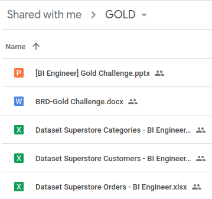
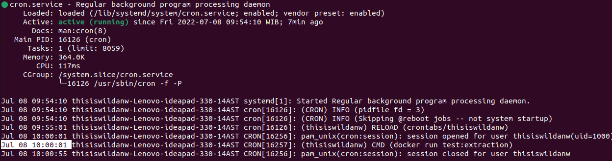
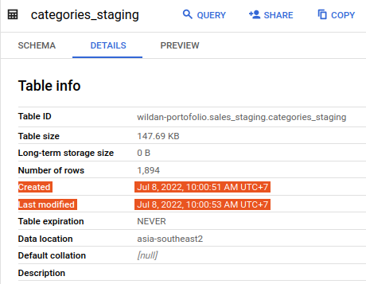
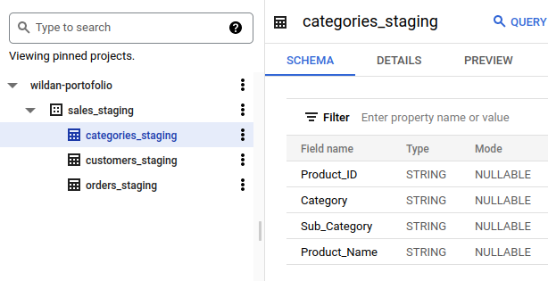
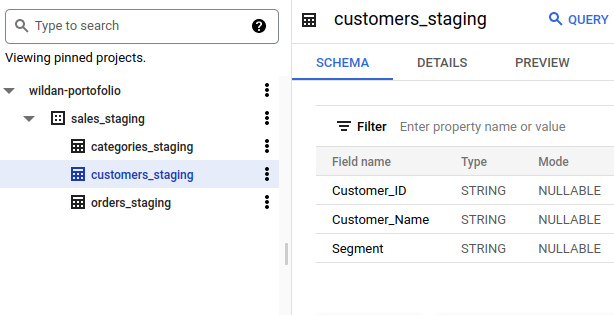
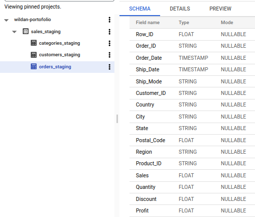
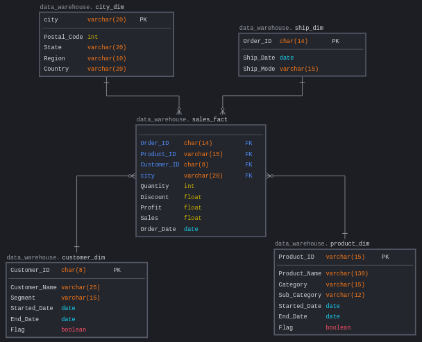
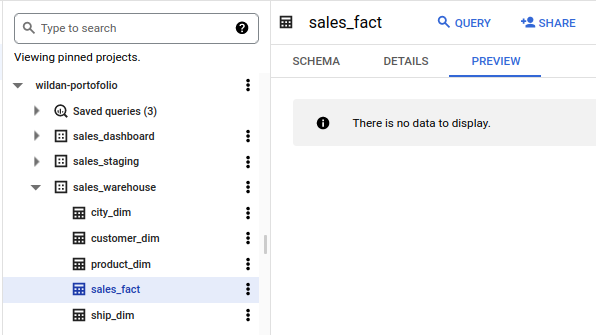
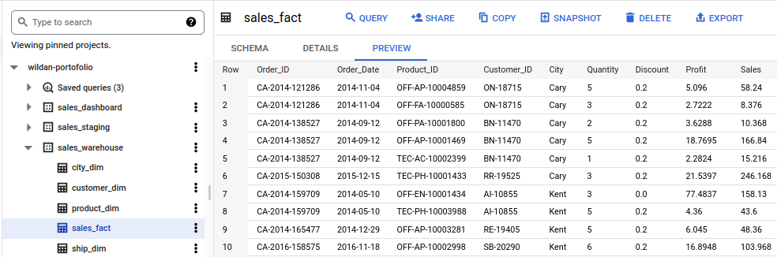

Superstore Sales Data Pipeline
==============================
This is a modified tean final project after participated Business Intelligence Engineer Bootcamp among 2-3 months at [Binar Academy](https://www.binaracademy.com/). There are 2 main modification of this project: 
1. Using docker, python and crontab to automate data extraction process.
2. Create new dashboard with more proper KPI. 

Table of Content
================
- [Superstore Sales Data Pipeline](#superstore-sales-data-pipeline)
- [Table of Content](#table-of-content)
  - [Project Overview](#project-overview)
  - [Dataset](#dataset)
  - [Tools and Technology](#tools-and-technology)
  - [Project Architecture](#project-architecture)
    - [Data Extraction](#data-extraction)
    - [Data Transform and Load](#data-transform-and-load)
    - [Data Visualization](#data-visualization)
  - [Further Improvements](#further-improvements)
  - [Special Thanks](#special-thanks)


## Project Overview
<p>This project contains the process of retrieving, cleaning, and standardizing data from flat files and designing a data warehouse in Google BigQuery so we can use it to build superstore sales visualization dashboards (monthly, quarterly and yearly).</p> 

<p>There are 3 main process of this project. First, we use python to automate flat files extraction process from Google Drive and load it to data staging Google BigQuery. Secondly, we are transform the data staging and build data warehouse in Google BigQuery, schedule it monthly using BigQuery Scheduler. At the end, we will use Google Data Studio to build superstore sales visualization dashboard.</p>

## Dataset

<p>The data used in this project is public dataset from superstore that shared by Binar Academy via Google Drive shared folder. There are 3 flat files (.xlsx) in 'GOLD' shared folder that will be used: </p>

1. **Dataset Superstore Categories - BI Engineer.xlsx**
2. **Dataset Superstore Customers - BI Engineer.xlsx**
3. **Dataset Superstore Orders - BI Engineer.xlsx**

<br>
<p align="center">
  
</p>
<br>

## Tools and Technology  
- **Cloud**: Google Cloud Platform (GCP).
  - Data Warehouse : Google BigQuery.
  - Data Backup : Google Storage.
- **Key Access** : Client Credentials (Google Drive API), Service Account (GCP).
- **Data Visualization** : Google Data Studio 
- **Programming Language** : Pyhton, SQL.
- **Containerization** : Docker.
- **Scheduler** : Crontab, BigQuery Scheduler.

## Project Architecture
<p align="center">
  
</p>

### Data Extraction

**1. Create Python Code to Extract and Load Google Drive Folder**

  We have build several python function in drive_gcs_intgr.py to extract data from Google Drive and load it into data staging in BigQuery.

  - **gdrive_auth()** is used to access google drive via pydrive library. Make sure place JSON credentials files in same folder before running this function. Here is the documentation and tutorials : 
      - Pydrive documentation : [link](https://pythonhosted.org/PyDrive/)
      - Tutorial to genereate Google Drive API client credentials : [link](https://www.iperiusbackup.net/en/how-to-enable-google-drive-api-and-get-client-credentials/)  
  - **get_folder()** is used to get the folder link and download it from Google Drive via pydrive with gdown library. Authentication process using gdrive_auth() and specific folder names may be required to execute this function. Here is the repository of gdown : [link](https://github.com/wkentaro/gdown)
  - **clean_name()** is used to get clean name of flat files. So we can create pandas dataframe and data staging based on each flat files name.
  - **excel_files_to_pandas()** is used to convert each flat files or excel files to dataframe using pandas and put it together into python dictionary.  
  - **main()** is used to execute authentication, download and flat files extraction process into python dictionary. Then, load each dataframe in dictionary to data staging in BigQuery with table name = cleaned flat file name. Replace old tables with new tables if exist.  

**2. Build Dockerfile to Standardized Python Environments**

``` docker
FROM python:3.9
COPY python-file/* ./
RUN pip install -r requirements.txt
RUN echo "Asia/Jakarta" > /etc/timezone
ENTRYPOINT [ "python", "drive_gcs_intgr.py" ]
```

``` docker
docker build -t test:extraction .
```

**3. Automate Docker Run By First Day of The Month at 01.00 AM Using CronTab**
``` crontab
0 1 1 * * docker run test:extraction
```

**4. Data Extraction Test**
First changed cron job to execute drive_gcs_intgr.py inside docker every 10 minute.

``` docker.
*/10 * * * * docker run test:extraction
```

Check cron status. 
``` 
service cron status
```
<p align="center">
  
</p>


The Test Result: 
  The cron job was scheduled at 8 July 10.00 am match with every table "created at" metadata in data staging. That means we have successfully extracted files from google drive to google BigQuery on July 8 10.00 am.
  <br>
  <p align="center">
  
  </p>

**4. Data Extraction Result**
  
  <p align="center">
  
  </p>
  <p align="center">
  
  </p>
  <p align="center">
  
  </p>


<br>

### Data Transform and Load

  **1. Create Empty Fact and Dimension Table Based on Data Warehouse Modeling**
   
  Main process: 
   - Design a star schema data model for data warehouse using [sqldbm](https://app.sqldbm.com). 
   - Create sales_warehouse dataset in BigQuery.
   - Create empty fact and dimension table based designed data model.
    
  Star Schema Model:  

  <p align="center">
      
  </p>
     
  <p align="center">
      
  </p>

  Empty Sales Fact For Example:
  <p align="center">
      
  </p>
  <br>
   

**2. Create Data Staging to Data Warehouse Data Flow Query**
  
  This query contain several process:  
  - Inflow process from order_staging to sales_fact, ship_dim and city_dim
  - Inflow process from categories_staging to product_dim using SCD Type-2
  - Inflow process from customer_staging to customer_dim using SCD Type-2
  
  Here the query:
  ``` sql
  #Inflow sales_staging.categories to sales_warehouse.product_dim using SCD Type 2 
  ## There was no created_at product in categories staging,
  ## So we have no choices, to use "GROUP BY" to handle duplicates Product_ID 
  MERGE `wildan-portofolio.sales_warehouse.product_dim` p_dim
  USING (
    SELECT 
      Product_ID,
      Product_Name,
      Category,
      Sub_Category
    FROM `wildan-portofolio.sales_staging.categories_staging`
    GROUP BY 1,2,3,4
    ) cs
    ON p_dim.Product_ID = cs.Product_ID
  WHEN NOT MATCHED THEN 
    INSERT VALUES (
      cs.Product_ID,
      cs.Category,
      cs.Sub_Category,
      cs.Product_Name,
      CURRENT_DATE(),
      NULL,
      TRUE
    )
  WHEN MATCHED AND (
    p_dim.Category <> cs.Category
    OR p_dim.Sub_Category <> cs.Sub_Category
    OR p_dim.Product_Name <> cs.Product_Name
  )
  THEN UPDATE SET 
    End_Date = CURRENT_DATE, Flag = False;

  #Inflow sales_staging.customers_staging to sales_warehouse.cutomers_dim using SCD Type 2
  MERGE `wildan-portofolio.sales_warehouse.customer_dim` c_main
  USING `wildan-portofolio.sales_staging.customers_staging` ts
  ON c_main.Customer_ID = ts.Customer_ID
  WHEN NOT MATCHED THEN 
    INSERT VALUES (
      ts.Customer_ID,
      ts.Customer_Name,
      ts.Segment,
      CURRENT_DATE(),
      NULL,
      TRUE
    )
  WHEN MATCHED AND (
    c_main.Customer_ID <> ts.Customer_ID
    OR c_main.Customer_Name <> ts.Customer_Name
    OR c_main.Segment <> ts.Segment
  )
  THEN UPDATE SET 
    End_Date = CURRENT_DATE(), Flag = False;

  #Inflow sales_staging.order_staging to sales_warehouse.sales_fact
  MERGE `wildan-portofolio.sales_warehouse.sales_fact` s_main
  USING `wildan-portofolio.sales_staging.orders_staging` os
  ON 
    s_main.Order_ID = os.Order_ID 
    AND s_main.Order_Date = DATE(os.Order_Date)
    AND s_main.Product_ID = os.Product_ID
    AND s_main.Customer_ID = os.Customer_ID
    AND s_main.City = os.City
    AND s_main.Quantity = CAST(ROUND(os.Quantity) AS INT64)
    AND s_main.Discount = os.Discount
    AND s_main.Profit = os.Profit
    AND s_main.Sales = os.Sales
  WHEN NOT MATCHED THEN 
    INSERT VALUES (
      os.Order_ID,
      DATE(os.Order_Date),
      os.Product_ID,
      os.Customer_ID,
      os.City,
      CAST(ROUND(os.Quantity) AS INT64),
      os.Discount,
      os.Profit,
      os.Sales
    );

  #Inflow sales_staging.order_staging to sales_warehouse.ship_dim
  MERGE `wildan-portofolio.sales_warehouse.ship_dim` sh_main
  USING (
    SELECT
      Order_ID,
      Ship_Date,
      Ship_Mode 
    FROM
  `wildan-portofolio.sales_staging.orders_staging`
    GROUP BY
      Order_ID,
      Ship_Date,
      Ship_Mode) os
  ON 
    sh_main.Order_ID = os.Order_ID 
    AND sh_main.Ship_Date = DATE(os.Ship_Date)
    AND sh_main.Ship_Mode = os.Ship_Mode
  WHEN NOT MATCHED THEN 
    INSERT VALUES (
      os.Order_ID,
      DATE(os.Ship_Date),
      os.Ship_Mode
    );

  #Inflow sales_staging.order_staging to sales_warehouse.city_dim
  MERGE `wildan-portofolio.sales_warehouse.city_dim` sh_main
  USING (
    SELECT
      City,
      Postal_Code,
      State,
      Region,
      Country 
    FROM
  `wildan-portofolio.sales_staging.orders_staging`
    GROUP BY
      Postal_Code,
      City,
      State,
      Region,
      Country) os
  ON 
      sh_main.City = os.City 
      AND sh_main.Postal_Code = CAST(ROUND(os.Postal_Code) AS INT64)
      AND sh_main.State = os.State
      AND sh_main.Region = os.Region
      AND sh_main.Country = os.Country 
  WHEN NOT MATCHED THEN 
    INSERT VALUES (
      City,
      CAST(ROUND(os.Postal_Code) AS INT64),
      State,
      Region,
      Country
    );
  ```
<br>
The Query Result For Sales Fact 
<p align="center">
      
  </p>
<br>

**3. Create Aggregation Table For Dashboard By Querying Data Warehouse**

``` sql 
DROP TABLE IF EXISTS `wildan-portofolio.sales_dashboard.yearly_sales_performance`;
CREATE TABLE `wildan-portofolio.sales_dashboard.yearly_sales_performance` AS  
WITH first_last_order AS ( 
  SELECT
  Customer_ID,
  Order_ID,
  Order_Date,
  City,
  CASE 
    WHEN ROW_NUMBER() OVER (PARTITION BY Customer_ID ORDER BY  Order_Date) = 1 THEN 1
    ELSE 0
  END AS Is_First_Order,
  CASE 
    WHEN ROW_NUMBER() OVER (PARTITION BY Customer_ID ORDER BY Order_Date DESC) = 1 THEN 1
    ELSE 0
  END AS Is_Last_Order,
  Qty,
  ROUND(Cost,1) Gross_Cost,
  ROUND(Gross_Sales-Cost,1) Mark_Up,
  ROUND(Discount,1) Discount_Cost,
  ROUND(Sales,1) Sales,  
  CASE
    WHEN Profit > 0 THEN 0
    ELSE ROUND(Profit,1)
  END AS Loss,
  CASE 
    WHEN Profit >= 0 THEN ROUND(Profit,1)
    ELSE 0
  END AS Profit,
  FROM(
    SELECT
      Customer_ID,
      Order_ID,
      Order_Date,
      City,
      SUM(Quantity) Qty,
      SUM(Sales+(Discount*Sales)) Gross_Sales,
      SUM(Discount*Sales*-1) Discount,
      SUM(Sales) Sales,
      SUM(Sales-Profit) Cost,
      SUM(Profit) Profit,
    FROM
      `wildan-portofolio.sales_warehouse.sales_fact`
    GROUP BY Customer_ID, Order_ID, Order_Date, City)
)

SELECT
  fl.* EXCEPT (City),
  cdim.* EXCEPT (Customer_ID, Started_Date, End_Date,Flag),
  ct.* EXCEPT (City, Postal_Code, State, Country)
FROM first_last_order fl
  INNER JOIN `wildan-portofolio.sales_warehouse.customer_dim` cdim
  ON fl.Customer_ID = cdim.Customer_ID 
    INNER JOIN `wildan-portofolio.sales_warehouse.city_dim` ct
    ON ct.City =fl.City
ORDER BY fl.Customer_ID, Order_Date DESC
```

**4. Automated Each Query Execution By First Day of The Month at 04.00 AM**

### Data Visualization
**1. Old Visualization**
**2. New Visualization**
**3. Infomation and Insight From New Visualization**

## Further Improvements
