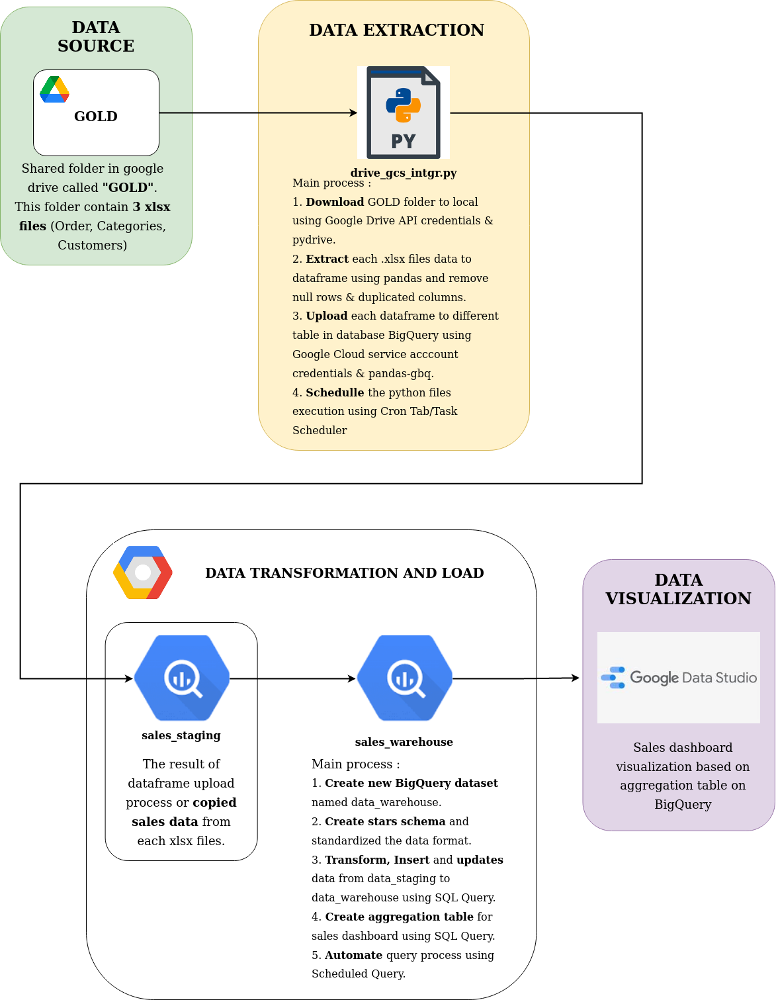

Superstore Sales Data Pipeline (On Progress)
==============================
This is a final project after participated Business Intelligence Engineer Bootcamp among 2-3 months at [Binar Academy](https://www.binaracademy.com/). Its fun to learn new knowledge (Technical Documentation, ETL Process & Data Warehousing) and technologies (Google Cloud Platform, BigQuery & Data Studio) related to BI Engineering job. Appreciated the organizer and instuctors, they really design a good syllabus and guide students well. 

Table of Content
================
- [Superstore Sales Data Pipeline](#superstore-sales-data-pipeline)
- [Table of Content](#table-of-content)
  - [Project Overview](#project-overview)
  - [Dataset](#dataset)
  - [Tools and Technology](#tools-and-technology)
  - [Project Architecture](#project-architecture)
    - [Data Extraction](#data-extraction)
    - [Data Transform and Load](#data-transform-and-load)
    - [Data Visualization](#data-visualization)
  - [Further Improvements](#further-improvements)V
  - [Special Thanks](#special-thanks)

## Project Overview

This project contains the process of retrieving, cleaning, and standardizing data from flat files and designing a data warehouse in Google BigQuery so we can use it to build superstore sales visualization dashboards (monthly, quarterly and yearly).
 

There are 3 main process of this project. First, we use python to automate flat files extraction process from Google Drive and load it to data staging Google BigQuery. Secondly, we are transform the data staging and build data warehouse in Google BigQuery, schedule it monthly using BigQuery Scheduler. At the end, we will use Google Data Studio to build superstore sales visualization dashboard.

## Dataset

The data used in this project is public dataset from superstore that shared by Binar Academy via Google Drive shared folder. There are 3 flat files (.xlsx) in 'GOLD' shared folder that will be used: 

1. **Dataset Superstore Categories - BI Engineer.xlsx**
2. **Dataset Superstore Customers - BI Engineer.xlsx**
3. **Dataset Superstore Orders - BI Engineer.xlsx**

 

  

 

## Tools and Technology  
- **Cloud**: Google Cloud Platform (GCP)
  - Data Warehouse : Google BigQuery
  - Data Backup : Google Storage
- **Access Key** : Client Credentials (Google Drive API), Service Account (GCP)
- **Data Visualization** : Google Data Studio 
- **Programming Language** : Pyhton, SQL

## Project Architecture

  

  ### Data Extraction
  
  We have build several python function in drive_gcs_intgr.py to extract data from Google Drive and load it into data staging in BigQuery.

  - **gdrive_auth()** is used to access google drive via pydrive library. Make sure place JSON credentials files in same folder before running this function. Here is the documentation and tutorials : 
      - Pydrive documentation : [link](https://pythonhosted.org/PyDrive/)
      - Tutorial to genereate Google Drive API client credentials : [link](https://www.iperiusbackup.net/en/how-to-enable-google-drive-api-and-get-client-credentials/)  
  - **get_folder()** is used to get the folder link and download it from Google Drive via pydrive with gdown library. Authentication process using gdrive_auth() and specific folder names may be required to execute this function. Here is the repository of gdown : [link](https://github.com/wkentaro/gdown)
  - **clean_name()** is used to get clean name of flat files. So we can create pandas dataframe and data staging based on each flat files name.
  - **excel_files_to_pandas()** is used to convert each flat files or excel files to dataframe using pandas and put it together into python dictionary.  
  - **main()** is used to execute authentication, download and flat files extraction process into python dictionary. Then, load each dataframe in dictionary to data staging in BigQuery with table name = cleaned flat file name. Replace old tables with new tables if exist.  

  Here is orders, categories and customers staging that we have created by executing **drive_gcs_intgr.py** : 
  

  
  

  

  
  

  

  
  

  ### Data Transform and Load

  **1. Create Empty Fact and Dimension Table Based on Data Warehouse Modeling**
  
   Main Step: 
    - Design a star schema data model for data warehouse using [sqldbm](https://app.sqldbm.com).
    - Create sales_warehouse dataset in BigQuery.
    - Create empty fact and dimension table with each schemas based designed data model. 
    
    The Result:  

  

      
  
 
    

**2. Data Staging to Data Warehouse Query (Inflow)**
  This query contain several process:  
  - Insert and Update Sales Fact
  - Implement 
  3. Data Warehouse to Aggregation Table Query (Upflow)

  ### Data Visualization

## Further Improvements
## Special Thanks
