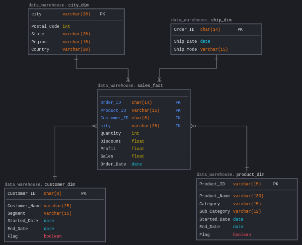
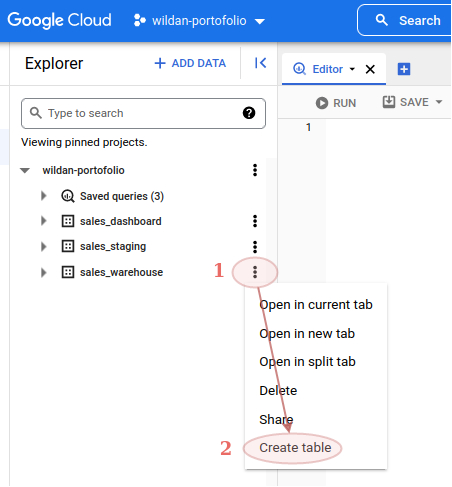
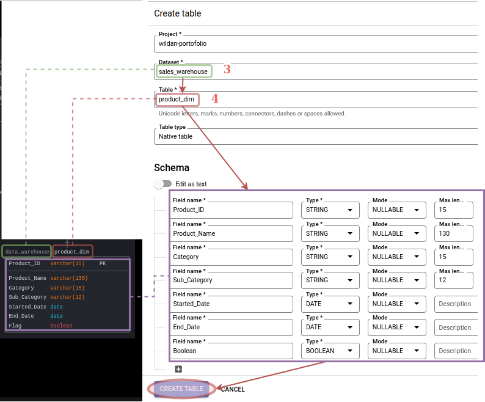
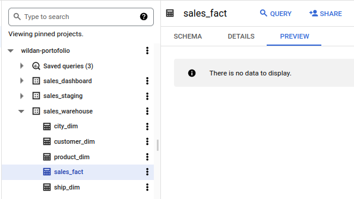
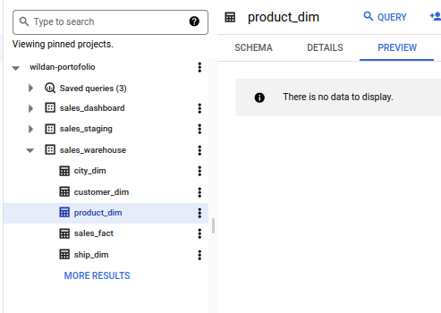
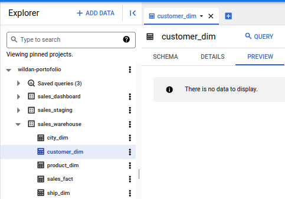
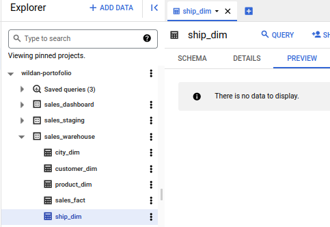
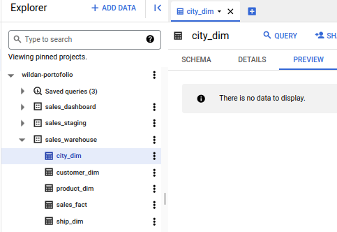

# Data Warehouse

  ## Design Data Model
   
  We use [sqldbm](https://app.sqldbm.com) to design star-schema data model. 

  

      
  

  ## Create empty table based on data model.
  Tutorial (product_dim) : 

  

      
  

  

      
  

   

  Empty Sales Fact Table :
  

      
  

   

  Empty Product Dimension Table:
  

      
  

   

  Empty Customer Dimension Table :
  

      
  

   
  
  Empty Ship Dim Table :
  

      
  

   

  Empty City Dim Table :
  

      
  

   
   

  ## [Create Inflow query to move and transform data from sales staging to sales warehouse](upflow-query)
  
  Create scheduled queries by first day of month at 01.05 am that contain several process:  
  - Transform order_staging to sales_fact, ship_dim and city_dim
  - Transform categories_staging to product_dim using SCD Type-2
  - Transform customer_staging to customer_dim using SCD Type-2

  Click here to [More Details](inflow-query) 

## Create Downflow query to backup sales warehouse to Google Storage.

## Create Upflow query for sales performance dashboard.

## Create Upflow query for RFM dashboard.

