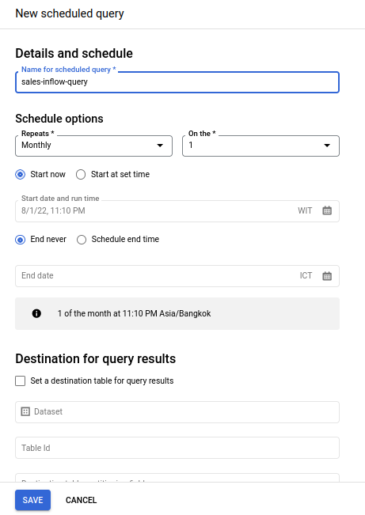

# Create Inflow query to move and transform data from data staging to data warehouse.

## Transform & load order_staging to sales_fact, ship_dim and city_dim using SQL Query

``` sql
#Inflow sales_staging.order_staging to sales_warehouse.sales_fact
MERGE `wildan-portofolio.sales_warehouse.sales_fact` s_main
USING `wildan-portofolio.sales_staging.orders_staging` os
ON 
  s_main.Order_ID = os.Order_ID 
  AND s_main.Order_Date = DATE(os.Order_Date)
  AND s_main.Product_ID = os.Product_ID
  AND s_main.Customer_ID = os.Customer_ID
  AND s_main.City = os.City
  AND s_main.Quantity = CAST(ROUND(os.Quantity) AS INT64)
  AND s_main.Discount = os.Discount
  AND s_main.Profit = os.Profit
  AND s_main.Sales = os.Sales
WHEN NOT MATCHED THEN 
  INSERT VALUES (
    os.Order_ID,
    DATE(os.Order_Date),
    os.Product_ID,
    os.Customer_ID,
    os.City,
    CAST(ROUND(os.Quantity) AS INT64),
    os.Discount,
    os.Profit,
    os.Sales
  );
```

``` sql
#Inflow sales_staging.order_staging to sales_warehouse.ship_dim
MERGE `wildan-portofolio.sales_warehouse.ship_dim` sh_main
USING (
  SELECT
    Order_ID,
    Ship_Date,
    Ship_Mode 
  FROM
 `wildan-portofolio.sales_staging.orders_staging`
  GROUP BY
    Order_ID,
    Ship_Date,
    Ship_Mode) os
ON 
  sh_main.Order_ID = os.Order_ID 
  AND sh_main.Ship_Date = DATE(os.Ship_Date)
  AND sh_main.Ship_Mode = os.Ship_Mode
WHEN NOT MATCHED THEN 
  INSERT VALUES (
    os.Order_ID,
    DATE(os.Ship_Date),
    os.Ship_Mode
  );
```

``` sql
#Inflow sales_staging.order_staging to sales_warehouse.city_dim
MERGE `wildan-portofolio.sales_warehouse.city_dim` sh_main
USING (
  SELECT
    City,
    Postal_Code,
    State,
    Region,
    Country 
  FROM
 `wildan-portofolio.sales_staging.orders_staging`
  GROUP BY
    Postal_Code,
    City,
    State,
    Region,
    Country) os
ON 
    sh_main.City = os.City 
    AND sh_main.Postal_Code = CAST(ROUND(os.Postal_Code) AS INT64)
    AND sh_main.State = os.State
    AND sh_main.Region = os.Region
    AND sh_main.Country = os.Country 
WHEN NOT MATCHED THEN 
  INSERT VALUES (
    City,
    CAST(ROUND(os.Postal_Code) AS INT64),
    State,
    Region,
    Country
  );
```

Result : 

## Transform & load categories_staging to product_dim using SCD Type-2 using SQL Query
Query : 
Result : 
## Transform & load customer_staging to customer_dim using SCD Type-2 using SQL Query
Query : 
Result : 

## Set query schedule by first month at 01.30 am  
  <br> 
  <p align="center">
      
  </p>